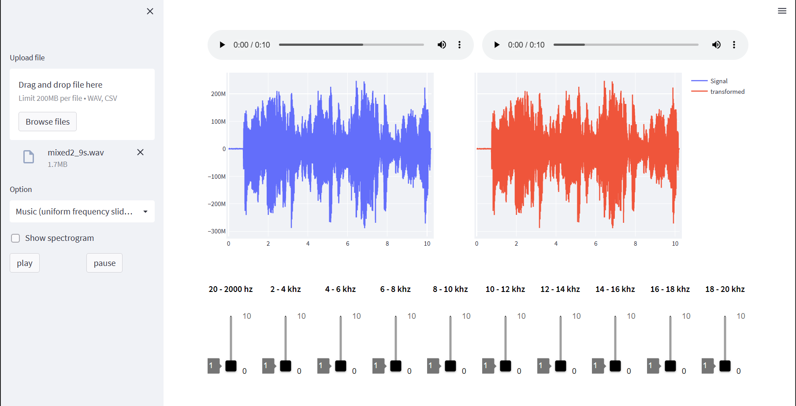

# Audio Equalizer app
#### Python web application that processes different audio files. 
 
 ## Description
 This app has the following features:
 - Upload an audio file to be equalized on different modes (uniform - music - medical).
 - play the audio before and after processing.
 - Plot the Audio and its spectrogram (Dynamic plots are also supported).
 
 ## Dependencies
 - **Python 3.10** 
 - **JavaScript**
 - **HTML**
 - **CSS**
 ### Used libraries
 - numpy
 - flask
 - PIL
 - werkzeug.utils
 - os
 - cv2
 - matplotlib.pyplot
 - plotly.express
 - matplotlib.pyplot
 
 ## Preview
#### Uploading an Audio file.

#### Spectrogram.

